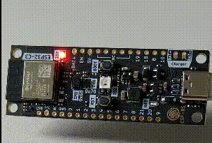

# Blinky

Let's see how to create the iconic _Blinky_.



Change the code in `main.rs` to this
```rust,ignore
#![no_std]
#![no_main]

use esp32c3_hal::{
    clock::ClockControl, pac::Peripherals, prelude::*, timer::TimerGroup, Delay, Rtc, IO,
};
use esp_backtrace as _;

#[riscv_rt::entry]
fn main() -> ! {
    let peripherals = Peripherals::take().unwrap();
    let system = peripherals.SYSTEM.split();
    let clocks = ClockControl::boot_defaults(system.clock_control).freeze();

    // Disable the RTC and TIMG watchdog timers
    let mut rtc = Rtc::new(peripherals.RTC_CNTL);
    let timer_group0 = TimerGroup::new(peripherals.TIMG0, &clocks);
    let mut wdt0 = timer_group0.wdt;
    let timer_group1 = TimerGroup::new(peripherals.TIMG1, &clocks);
    let mut wdt1 = timer_group1.wdt;

    rtc.swd.disable();
    rtc.rwdt.disable();
    wdt0.disable();
    wdt1.disable();

    esp_println::println!("Hello World");

    // Set GPIO7 as an output, and set its state high initially.
    let io = IO::new(peripherals.GPIO, peripherals.IO_MUX);
    let mut led = io.pins.gpio7.into_push_pull_output();

    led.set_high().unwrap();

    // Initialize the Delay peripheral, and use it to toggle the LED state in a
    // loop.
    let mut delay = Delay::new(&clocks);

    loop {
        led.toggle().unwrap();
        delay.delay_ms(500u32);
    }
}
```

We need two new types in scope: `IO` and `Delay`

On ESP32-C3-DevKit-RUST-1 there is a regular LED connected to GPIO 7. If you use another board consult the data-sheet.

Please note that most dev-boards today use an addressable LED which works different and is beyond the scope of this book. In that case you can also connect a regular LED to some of the free pins (and don't forget to add a resistor).

Here we see that we can drive the pin high, low or toggle it.

We also see that the HAL offers a way to delay execution.
